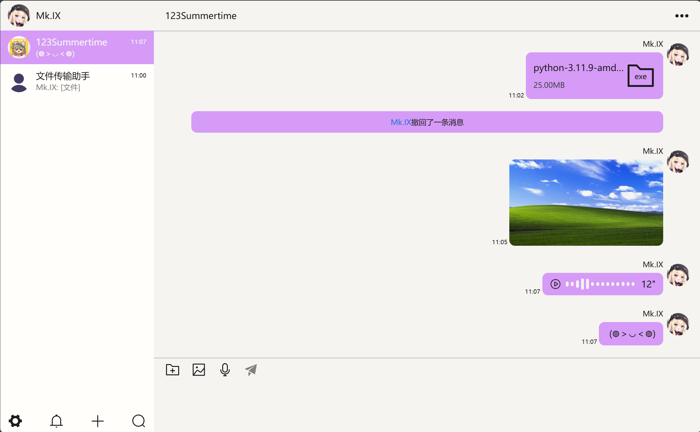
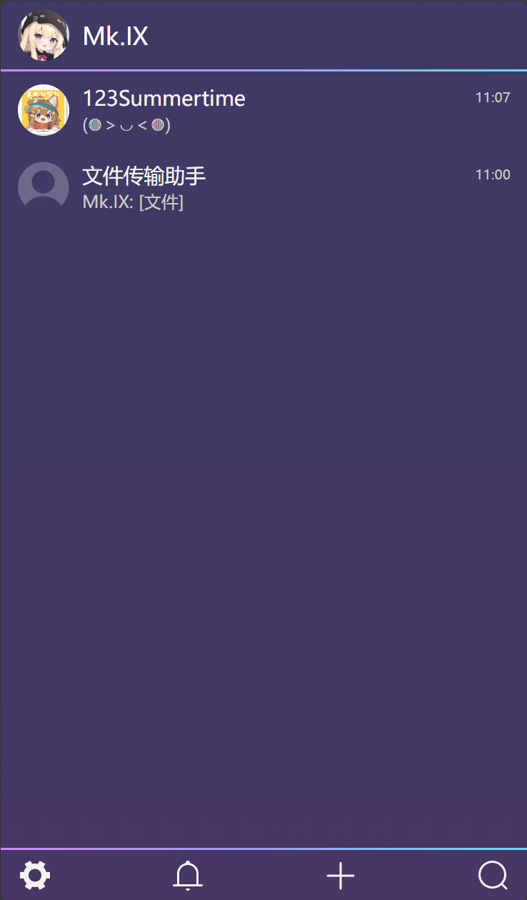
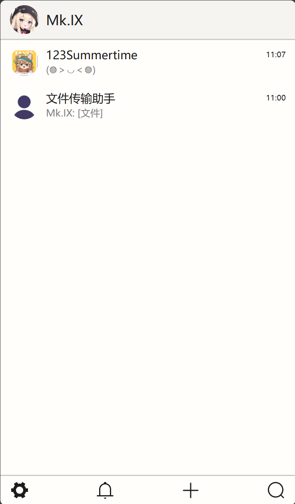

## 介绍
`Mk.IX-Client` 是基于 `Vue3` 构建的即时通讯 (IM) 前端，支持传统功能和 E2E 加密等功能。

后端[Mk.IX-Server](https://github.com/123summertime/Mk.IX-Server)


## 预览
<details>
    <summary>桌面端</summary>
    <div>
        
        
    </div>
</details>

<details>
    <summary>移动端</summary>
    
    
    
    
</details>


## 使用

> 保证后端[Mk.IX-Server](https://github.com/123summertime/Mk.IX-Server)正在运行

### 本地预览
1. 下载最新的 [Release](https://github.com/123summertime/Mk.IX-Client/releases)。
2. 启动本地服务器(需要python环境)：
   ```bash
   cd dist
   python -m http.server 8080
   ```

### 生产环境

通过`docker` + `nginx`部署

下载最新的[Release](https://github.com/123summertime/Mk.IX-Client/releases)

```
文件夹结构
|-- default.conf (创建)
|-- dist
|   |-- assets
|   |   |-- index-34d94241.js
|   |   `-- index-c5e85733.css
|   |-- favicon.ico
|   `-- index.html
```

<details>
    <summary>nginx(default.conf)配置参考</summary>

    # http
    server {
        listen       80;
        listen  [::]:80;
        server_name  localhost;

        location / {
            root   /etc/nginx/dist;
            try_files $uri /index.html
            index  index.html index.htm;
        }

        error_page   500 502 503 504  /50x.html;
        location = /50x.html {
            root   /usr/share/nginx/html;
        }
    }
</details>

拉取镜像
``` bash
docker pull nginx
```

启动
``` bash
docker run -d \
--name nginx1 \
-p 80:80 \
-v $(pwd)/default.conf:/etc/nginx/conf.d/default.conf \
-v $(pwd)/dist:/etc/nginx/dist \
nginx
```

访问`127.0.0.1`或`公网IP`就能看到页面

### 开发环境

``` bash

# 克隆仓库
git clone https://github.com/123summertime/Mk.IX-Client.git

# 进入项目目录
cd Mk.IX-Client

# 安装依赖
npm install

# 启动
npm run dev
```

## 许可

本项目基于 [MIT License](LICENSE) 进行许可。